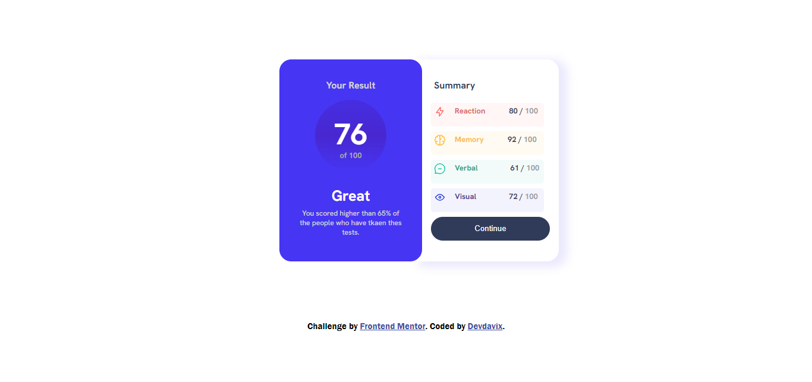

# Results summary component  - My Solution

## Hello there! 👋

I'm thrilled to present my solution to the  Results Summary Component Challenge from [Frontend Mentor](https://www.frontendmentor.io). This project allowed me to hone my front-end development skills, and I'm excited to showcase the result.

## Overview

### Screenshot

### Live Demo

Check out the live demo [here](https://results-summary-component-main-ashen.vercel.app/).

## Features

- Created an attractive and responsive Product Preview Card Component.
- Incorporated Font Awesome for stylish and scalable icons.
- Developed the component using HTML5 and CSS3.

## How to Use

1. Clone the repository: `git clone https://github.com/devdavix2/results-summary-component-main`
2. Open `index.html` in your preferred web browser.

## What I Learned

In this project, I gained hands-on experience in:

- Crafting and styling a product preview card using semantic HTML and CSS.
- Integrating Font Awesome for enhanced iconography.
- Ensuring a seamless and responsive design across different devices.

## Future Enhancements

Looking ahead, I plan to:

- Integrate interactive elements using JavaScript.
- Refine the design for an even more polished user experience.

## Credits

- Challenge by [Frontend Mentor](https://www.frontendmentor.io?ref=challenge)
- Developed with passion by [Devdavix](https://github.com/devdavix2)

## Connect With Me

Feel free to reach out for questions, feedback, or just to say hi! You can drop me an email at [devdavixx@gmail.com].

## Special Thanks

A big shoutout to Frontend Mentor for providing these fantastic challenges that continuously push us to improve our skills!

---

Feel free to customize this template according to your specific details. Replace placeholder URLs and contact information with your actual data. Happy coding! �